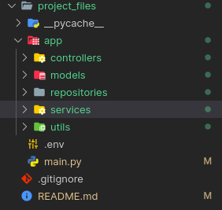

# Fast-Api-course | Confirm

## Summary

1. MVC VS CSR
2. Build your app with a more complexe architecture
3. Create your first controller

## Introduction

Now that you passed the beginner course, it's time to add perfect a bit our code.

You will see in this course :

- Why do we choose CSR (Controller, Service, Repository) architecture instead of MVC (Model, View, Controller)
- How to build your API around this architecture

## MVC VS CSR

`MVC` also known as Model, View, Controller is a good project architecture but our API doesn't return any HTML or XAML view, it only return JSON.

We choose CSR (Controller, Service, Repository) because it seems to be more appropriate to our project and our need.

But you have to know, that it's possible to add Services and Respository to an MVC architecture.

**Controllers**

> A controller is responsible for controlling the way that a user interacts with the rest of the application.
> A controller **shouldn't** contain any logic (like checking if the user exist or not, that's the role of the Service)

**Services**

> It's where your application logic is written, like if the user exist, call an extern API, and it's where you are formatting your responses

**Repository**

> The repository can only being called by a Service, and it's where your app get connected to your unique or multiple database

## Build your app with a more complexe architecture

This is how your project should look like at the end of the exercise



`main.py`

> Is the root of your application, it must only contain your `FastAPI` instance

`/app`

> Is the main folder which will contain the rest of the application

`controllers`

> This folder must contain all your controllers files

`models`

> This folder must contain all your models files like (UserIn and UserOut)

`repositories`

> This folder must contain all your repositories files

`services`

> This folder must contain all your services files

`utils`

> This folder contain all the utils you might need in your project like (parser, formatter, get data from .env, etc...)

`assets`

> This folder must contain all your file, images, etc...

## Create your first controller

In the controllers folder, create a controller file like so : `user_controller.py`

Next you will create the instance of your controller :

```py
from fastapi import APIRouter

user_controller = APIRouter(
    prefix="/user",
    tags=["user-controller"]
)
```

The prefix will be your route prefix in your url like : `http://localhost:4000/user`

Now you can implents all the previous endpoints :

```py

@user_controller.get("s")
def get_users():
    return get_all()


# get user by id
@user_controller.get("/{id}", response_model=UserOut)
def get_user(id: int):
    return get_by_id(id)

# update the user
@user_controller.post("/{id}", response_model=UserIn, response_model_exclude={"password"})
def update_user(id: int, user: UserIn):
    return update(id, user)

# add a user to our collection
@user_controller.put("")
def add_user(user: UserIn):
    return add(user)

# delete an existing user
@user_controller.delete("/{id}")
def delete_user(id: int):
    return delete(id)

```

As you can see your controller will be really small, which make it easier to maintain.

## Create your first service

In the services folder, create a service file like so : `user_service.py`

> Remember : here is our logic

```py

from app.models.user.user_in import UserIn
from fastapi import HTTPException
from fastapi.responses import JSONResponse
from fastapi.encoders import jsonable_encoder


def get_by_id(id: int):
    try:
        return get_user_by_id(id)
    except:
        raise HTTPException(
            status_code=400, detail=f'User with id : {id} not found')

def get_all():
    return JSONResponse(status_code=200, content=get_all_users())

def update(id: int, user: UserIn):
    try:
        if(get_user_by_id(id) is None):
            raise HTTPException(
                status_code=400, detail=f'User with id : {id} not found')
        update_user(id, user)
        return user
    except:
        raise HTTPException(
            status_code=400, detail=f'Not able to update user with id {id}')

def add(user: UserIn):
    add_user(user)
    return JSONResponse(status_code=200, content=jsonable_encoder(user))

def delete(id: int):
    if(get_user_by_id(id) is None):
        raise HTTPException(
            status_code=400, detail=f'Impossible to delete User with id : {id} not found')
    delete_user(id)
    return JSONResponse(status_code=200, content={"isDeleted": True})

```

You will see that your `user_controller.py` still missed the service imports, you can simply import them like below :

```py
from app.services.user_service import add, delete, get_all, get_by_id, update
```

## Create your first repository

In the repositories folder, create a repository file like so : `user_repository.py`

> Remember : this file should only contain your database logic

```py
from app.models.user.user_in import UserIn

"""
    Fake Database
"""
user0 = {"id": 0, "name": "user0", "password": "test0"}
user1 = {"id": 1, "name": "user1", "password": "test1"}
user2 = {"id": 2, "name": "user2", "password": "test2"}

users = [user0, user1, user2]


def get_all_users():
    return users


def get_user_by_id(id: int):
    return users[id]


def update_user(id: int, user: UserIn):
    users[id] = user


def add_user(user: UserIn):
    users.append(user)


def delete_user(id: int):
    users.pop(id)

```

Now, you can try to do the rest of the API :smile:
