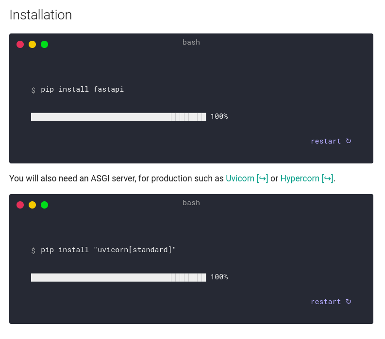

# Fast-Api-course | Beginner

## Summary
1. Introduction
2. First file
3. FastAPI instance
4. Create API's endpoints
5. Test your request using Postman
6. Exercise
7. Conclusion

## Introduction

Here is a simple FastApi structure, with all the CRUD methods

I recommand you to use Postman, and to import the collections, so you can test all the endpoints of the API we are building together.

To begin you don't need a strong project architecture, as python allow you to put everything in one single file.

This could be good, for a small project, are something which need to be done in less than 10 minutes, but remember that your project architecture have to grow as the same time as your project, or you might end with a 10K+ lines of code in one file...

To init your FastAPI project, you will have to simply install the requirements written on [FastAPI](https://fastapi.tiangolo.com/)



## First file

- Open you IDE (I personnaly recommend VsCode or Pycharms), and create a `.py` file.
- Conventions wants you to name it : `main.py` or `app.py` as you prefere

## FastAPI Instance

Then you will need to import `FastAPI` in your project

```py
from fastapi import FastAPI
```

Now you have to create your FastAPI instance, which is basically what python will call, when you will run / debug your project

```py
from fastapi import FastAPI

app = FastAPI()
```

FastAPI parameters are optionnals, but you can use them to describe and personnalize your API.

```py
app = FastAPI(
    title="PierroD - Beginner course",
    description=("Learn Fast API"),
    version="1.0.0",
    redoc_url="/swagger",
)
```

I personnaly re-write the redoc_url which is `localhost:port/docs` or `localhost:port/redoc` by default, because it will follow NodeJS swagger route patern, and fill way much natural for me.

## Create API's endpoints

Now that the instance of the project is done we will start creating some API's endpoints

As you might know, there are codes for HTTP request such as `GET / POST / PUT / PATCH / DELETE, etc...`

FastAPI provide a method for all of them such as `.get(), .post() .put() .patch() .delete() etc...`

```py
# we are using our FastAPI instance and add a GET request endpoint for '/users', which mean getAllUsers in REST
@app.get("/users")
def get_users():
    return users
```

As you can see we are returning `users` who doesn't exist in our files, so to get  rid of that, we will create a fake data collection 

```py
user0 = {"id": 0, "name": "user0", "password": "test0"}
user1 = {"id": 1, "name": "user1", "password": "test1"}
user2 = {"id": 2, "name": "user2", "password": "test2"}

users = [user0, user1, user2]
```

## Test your request using Postman

So now if you test your request using `Postman` you might receive something like this :

```json
[
    {
        "id": 0,
        "name": "user0",
        "password": "test0"
    },
    {
        "id": 1,
        "name": "user1",
        "password": "test1"
    },
    {
        "id": 2,
        "name": "user2",
        "password": "test2"
    }
]
```

## Exercise

Now that we get our first API request and json response, we will keep on going, and create the following endpoints :
- get_user_by_id (GET)
- add_user (POST or PUT)
- update_user (POST or PATCH)
- delete_user (DELETE)
  
You will need a Model to receive POST / PATCH /PUT request, so add the follow to your code :

```py
class User(BaseModel):
    id: int
    name: str
    password: str
```

You will need to add the import of this `BaseModel`

```py
from pydantic import BaseModel

```

I create this small samble where you only have to fill what's missing :

```py
# get user by id
@app.get("/user/{id}")
def get_user(id: int):
    return users[id]

# update the user
@app.post("/user/{id}")
def update_user(id: int, user: User):
    
# add a user to our collection
@app.put("/user")
def add_user(user: User):
    
# delete an existing user
@app.delete("/user/{id}")
def delete_user(id: int):
    
```

> You will find a corrected version of this exercise in the `project` folder of this github branch

## Conclusion :

You can now run your API using the following command : `uvicorn main:app` (or whatever your filename and FastAPI instance is called simply replace `main` and `app`)

But you can run it programmatically by adding the follwing to your `.py` file :

You need to import uvicorn to your project 
```py
import uvicorn
```

And add the following line to your code (donc forget to replace `main` with the name of your file and `app` with the name of your FastAPI instance)
```py
if __name__ == '__main__':
    uvicorn.run("main:app", host="localhost", port=4000, reload=True)
```


[Next course ->](https://github.com/PierroD/Fast-Api-course/tree/feat/confirm-course)